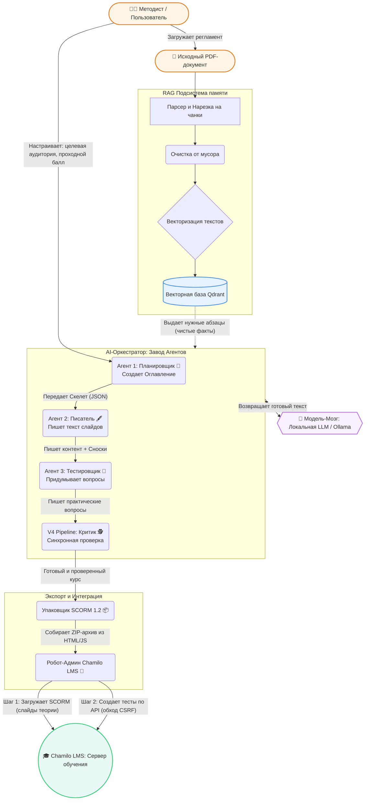

# Архитектура интеллектуального генератора SCORM-курсов: От сырого PDF до готового курса в LMS

Представьте классическую ситуацию в корпоративном обучении или образовании: у вас есть регламент, должностная инструкция или учебник на 200 страниц в формате PDF. Вам нужно превратить этот массив текста в интерактивный электронный курс, разбить его на модули, уроки, написать лаконичные тексты для слайдов, составить итоговое тестирование и загрузить всё это в Систему Дистанционного Обучения (СДО или LMS). 

Обычно эта задача занимает недели работы методиста и разработчика курсов. Мы же создали архитектуру, которая автоматизирует этот процесс от начала и до конца с помощью локальных нейросетей (LLM), продвинутого поиска (RAG) и умной оркестрации агентов.

Данная статья — глубокое (но понятное даже неспециалисту) погружение во внутреннее устройство нашего генератора курсов **SCORM-Chamilo Generator**.

---

## 1. Фундаментальная проблема: ИИ любит фантазировать

Если мы просто загрузим огромный документ в ChatGPT (или любую другую LLM) и попросим: *"Сделай из этого курс"*, мы столкнемся с тремя проблемами:
1. **Ограничение памяти (Контекстное окно):** Нейросеть не может "проглотить" и удержать в активной памяти книгу на сотни страниц за один раз. 
2. **Галлюцинации:** Если модель что-то забыла или не поняла, она начнет убедительно придумывать факты от себя, что категорически недопустимо в корпоративном (или медицинском, инженерном) обучении.
3. **Форматирование:** Ни одна нейросеть не отдаст вам готовый ZIP-архив в формате SCORM 1.2, который поймет ваша СДО. Она лишь выдаст полотно текста.

Чтобы решить эти проблемы, мы построили модульную архитектуру из пяти главных подсистем. Схема этой системы приведена ниже.

## 2. 🗺 Диаграмма: Взгляд на архитектуру с высоты птичьего полета

Ниже представлена полная схема конвейера — от загрузки файла до появления курса в системе дистанционного обучения:

---

## 2. RAG: Как научить ИИ читать корпоративные документы?

Вместо того чтобы заставлять нейросеть учить весь документ наизусть, мы используем технологию **RAG (Retrieval-Augmented Generation)** — генерацию, дополненную поиском. 

Аналогия: Это умный библиотекарь-архивариус, который помогает писателю.

**Как это работает под капотом:**
1. **Парсинг и чанкинг (Разрезание):** Мы берем ваш PDF-файл в 200 страниц и автоматически "разрезаем" его на небольшие, осмысленные логические кусочки по 2-3 абзаца (чанки). 
2. **Векторизация (Создание штрихкодов):** Специальная маленькая нейросеть-кодировщик превращает каждый этот текстовый кусочек в длинный массив чисел (вектор), который отражает *смысл* текста.
3. **База данных (Qdrant):** Мы складываем все эти "числовые слепки" (векторы) в векторную базу данных. Теперь наш документ превратился в огромную картотеку смыслов.

*Зачем это нужно?* Когда нашей основной нейросети нужно будет написать обучающий слайд на тему *"Правила эвакуации при пожаре"*, система не будет давать ей все 200 страниц. Она мгновенно найдет в базе *три самых релевантных абзаца* и отправит ИИ жесткий приказ: **"Напиши слайд про эвакуацию, используя ТОЛЬКО факты из этих трех абзацев"**. 
Именно RAG спасает нас от галлюцинаций — ИИ выступает лишь в роли редактора, формулирующего текст из железных фактов.

---

## 3. Оркестрация мульти-агентной системы

Генерация курса — слишком сложная комплексная задача для одного вызова ИИ. Поэтому процесс возглавляет программа-**Оркестратор**, которая руководит "отделом" виртуальных специалистов (Агентов). Работа идет в три фазы.

### Фаза А: Агент-Планировщик (Методист)
Сначала в дело вступает ИИ-Методист. Оркестратор дает ему вводные: *"Тема курса: Защита данных, целевая аудитория: Новички, длительность: 30 минут"*. 
Методист обращается к базе RAG, бегло просматривает основные оглавления файла и составляет **строгий скелет курса**:
* Какие будут модули?
* Какие внутри будут разделы (Раздел 1: Введение).
* Сколько будет слайдов-экранов в каждом разделе?

На этом этапе Агент-Методист не пишет ни строчки обучающего текста. Он выдает только структуру (оглавление), чтобы сэкономить время и вычислительные ресурсы сервера.

### Фаза Б: Агент-Писатель (Копирайтер уровня Pro)
Когда структура утверждена, Оркестратор запускает конвейер. Для **каждого отдельного экрана** (слайда) из оглавления просыпается Агент-Писатель. 
Его задача узко специализирована: Оркестратор выдает ему нужный заголовок экрана + релевантные факты (из RAG-базы) и просит: *"Сформируй 1 абзац теории, 3 тезиса для списка, и одну сноску-цитату"*.
Так, шаг за шагом, Агент-Писатель заполняет все "пустые слоты" оглавления глубоким и качественным контентом.

### Фаза В: Агент-Тестировщик
В конце просыпается Агент, специализирующийся на контроле знаний. Оркестратор скармливает ему весь написанный курс (или ключевые выжимки из RAG) и задает промпт: *"Придумай 10 сложных вопросов. Укажи 4 варианта ответов и какой из них правильный"*. 
В нашей архитектуре прописано важнейшее правило (системный промпт): **вопросы должны проверять реальные знания** из документа, а не быть общими (мы строго запрещаем ИИ генерировать плейсхолдеры вроде "Выберите вариант для вопроса 1").

### Дополнительно: Агент-Критик
Если Агент-Писатель схалтурил (например, написал слишком короткий текст или забыл проставить источники), может быть задействован механизм Валидации. Система (или Агент-Критик) проверяет JSON-ответ, ругается и автоматически отправляет запрос на переписывание бракованного слайда.

---

## 4. Сборка (Упаковщик SCORM Exporter)

Нейросеть сгенерировала отличный контент в формате JSON. Но ни одна LMS в мире не принимает сырой JSON. Языком электронного обучения (E-Learning) является **SCORM** (в частности, надежный и проверенный временем SCORM 1.2).

Наш программный Упаковщик действует как автоматическая типография:
1. Он берет JSON со структурой курса.
2. Генерирует для каждого слайда и раздела красивые HTML-страницы со стилями (CSS) и скриптами (JS).
3. Создает сложный системный файл `imsmanifest.xml` (паспорт курса, где прописаны связи всех элементов).
4. Упаковывает всё это в единый ZIP-архив.

Теперь этот ZIP-файл можно вручную загрузить в любую систему обучения (Moodle, iSpring, Chamilo, WebTutor), и курс безупречно запустится, а LMS будет фиксировать статус "В процессе" или "Пройдено" по мере перелистывания слайдов.

---

## 5. Интегратор LMS (Chamilo Client): Хакерская магия под капотом

Здесь начинается самое интересное инженерное решение нашего проекта. 

В стандарте **SCORM 1.2** есть серьезное ограничение. Если включить итоговый тест внутрь SCORM-архива, тест будет работать просто как "очередной слайд". Вопросы и варианты ответов будут жестко вшиты в HTML-код. LMS (например, Chamilo) не будет знать, на какие именно вопросы ученик ответил неправильно — она получит в лучшем случае только финальный балл (Score: 80%). Вы потеряете мощную аналитику LMS: статистику по каждому вопросу, рандомизацию вариантов, банк вопросов.

**Как мы изящно обошли это ограничение, автоматизировав работу админа?**

В состав нашего Генератора входит модуль **Chamilo Client**. Это "headless-клиент" (робот-браузер на уровне API), который выступает в роли умного курьера-администратора. Когда вы нажимаете кнопку *"Опубликовать в Chamilo"*, происходит следующий танец:

1. **Авторизация:** Робот по API логинится в вашей Chamilo LMS под вашим логином/паролем, сохраняя куки сессии (CookieJar).
2. **Загрузка Теории:** Робот загружает сгенерированный SCORM-архив в выбранный учебный курс. Но в этот SCORM входят *только* обучающие слайды (без финального теста).
3. **Нативное создание Теста:** Робот программно (эмулируя нажатия кнопок мыши и запросы браузера) заходит в инструмент "Упражнения" (Exercises) в Chamilo. Он создает там полноценный нативный тест Chamilo, перенося в него все придуманные нейросетью вопросы, варианты ответов, правильные варианты, настраивая проходной балл (например, 80%) и таймер.
4. **Бесшовная интеграция (Обход CSRF):** Последний штрих — нужно связать загруженный SCORM-курс с только что созданным "Упражнением", чтобы ученик, дойдя до последнего слайда SCORM, бесшовно перешел к прохождению теста. В Chamilo есть защита от автоматизации (CSRF-токены и проверка времени `post_time`). Наш Робот читает точное время на сервере вашей учебной платформы, синхронизируется с ним и успешно привязывает (линкует) "Нативный Тест" в самый конец "Траектории обучения" (Learning Path) SCORM-курса.

Итог публикации: Ваш сотрудник открывает курс. Он видит красивые слайды теории из SCORM. Как только теория заканчивается, система автоматически открывает мощный, встроенный в LMS тест со всей аналитикой, перемешиванием вопросов и контролем попыток.

## 6. Инженерные вызовы и их актуальные решения (Case Studies)

В ходе разработки мы столкнулись с множеством нетривиальных проблем, которые удалось изящно решить. Вот самые яркие кейсы, иллюстрирующие сложность "подкапотной" работы:

### Проблема 1: "Мусорный" контекст ломал работу ИИ
* **Симптомы:** LLM генерировала странный текст, вставляя номера телефонов, e-mail адреса авторов PDF-файла, ссылки и оборванные слова (артефакты переносов в PDF).
* **Суть проблемы:** PDF-парсеры вытаскивали колонтитулы и технические данные со страниц. База RAG засорялась нерелевантным шумом, который сбивал нейросеть с толку.
* **Решение:** Мы написали пайплайн очистки для RAG (`cleanRagText`). Система начала отфильтровывать e-mail адреса, URL, номера страниц, а также склеивать "разорванные переносами" слова обратно в целые термины еще *до* того, как текст попадет к Агенту-Писателю.

### Проблема 2: LLM генерировала "мета-заглушки" (Лень нейросети)
* **Симптомы:** В курсе появлялись экраны с названиями вроде *"Экран 1"* или *"Продолжение темы"*. Хуже того, Агент-Тестировщик выдавал вопросы уровня: *"Какой вариант ответа относится к вопросу номер 10?"* вместо того, чтобы проверять знания.
* **Суть проблемы:** Нейросеть (LLM) стремится поскорее закончить ответ (токены), заменяя глубокий анализ на шаблонные филлеры.
* **Решение:** Мы выстроили "жесткую диктатуру" в системных промптах (инструкциях). Мы категорически запретили использовать слова "Модуль X", "Экран Y" и использовать мета-вопросы. Мы задали строгий паттерн: *«Каждый заголовок должен отражать реальную тему (например, "Введение в цифровые двойники"), а каждый вопрос должен проверять освоение реального факта из переданного контекста»*.

### Проблема 3: Гонка агентов (Race Condition) в конвейере генерации
* **Симптомы:** Время от времени Оркестратор "проглатывал" экраны и оставлял их пустыми с плашкой *"Контент будет сгенерирован позже"*.
* **Суть проблемы:** В асинхронном JavaScript (нашем backend'е) Агенты-Писатели запускались параллельно для слишком большого количества экранов сразу (гонка за ресурсами локальной LLM). Модель-LLM не справлялась с нагрузкой, возвращала тайм-аут, и система тихо пропускала шаг.
* **Решение:** Мы внедрили V4 Pipeline — строгую, последовательную (синхронную) обработку каждого SCO (урока). Система пожертвовала скоростью ради 100% гарантии качества — теперь Оркестратор ждет завершения генерации предыдущего экрана, прежде чем писать следующий.

### Проблема 4: Защита от роботов в самой Chamilo LMS (CSRF)
* **Симптомы:** Сгенерированные тесты создавались в админке Chamilo, но система отказывалась "линковать" (прикреплять) тест в конец курса (Learning Path). Был тихий отказ от сервера.
* **Суть проблемы:** Административный интерфейс Chamilo имеет защиту от XSS и CSRF атак — он проверяет токен времени создания запроса (`post_time`), который должен в точности (до секунды) совпадать с серверным временем `time()` на PHP.
* **Решение:** Наш робот (Chamilo Client) притворился браузером на 100%. Перед отправкой формы связи он читает HTTP-заголовок `Date` самого веб-сервера Chamilo, вычисляет точное секундное время сервера и вписывает его в поддельное поле `post_time`. Теперь Chamilo LMS "думает", что кнопку нажал сам администратор с реального компьютера.

---

## Резюме
**SCORM-Chamilo Generator** — это не просто вызов одной нейросети. Это полноценная фабрика, где: 
* **RAG** отвечает за достоверность фактов.
* **Оркестратор** разделяет труд между ИИ-Методистом, ИИ-Писателем и ИИ-Тестировщиком.
* **SCORM Builder** превращает текст в классический E-learning формат.
* **Chamilo API Client** выполняет ювелирную доставку и настройку сложного тестирования в учебной системе, избавляя человека от часов рутинной работы.

Весь процесс от загрузки PDF до появления курса в системе дистанционного обучения занимает считанные минуты, работает локально (без утечек данных в облако) и выдает результат профессионального методического качества.
